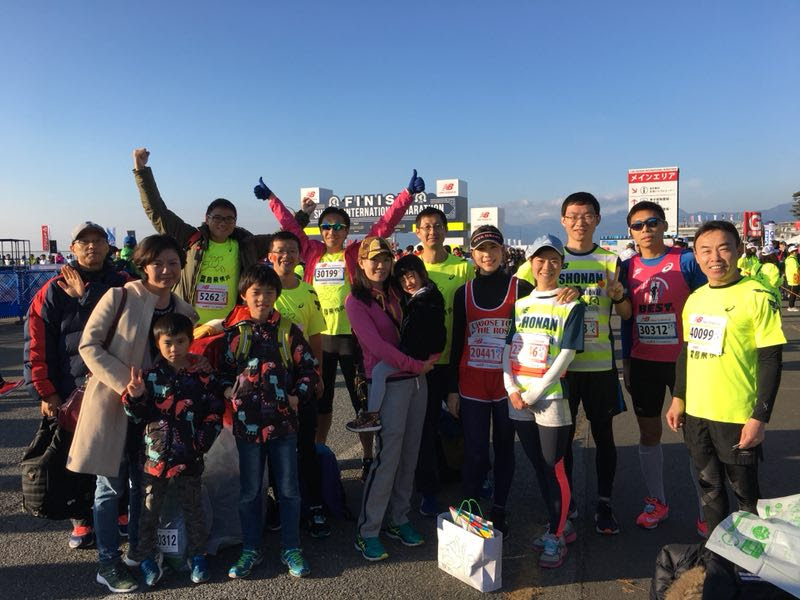
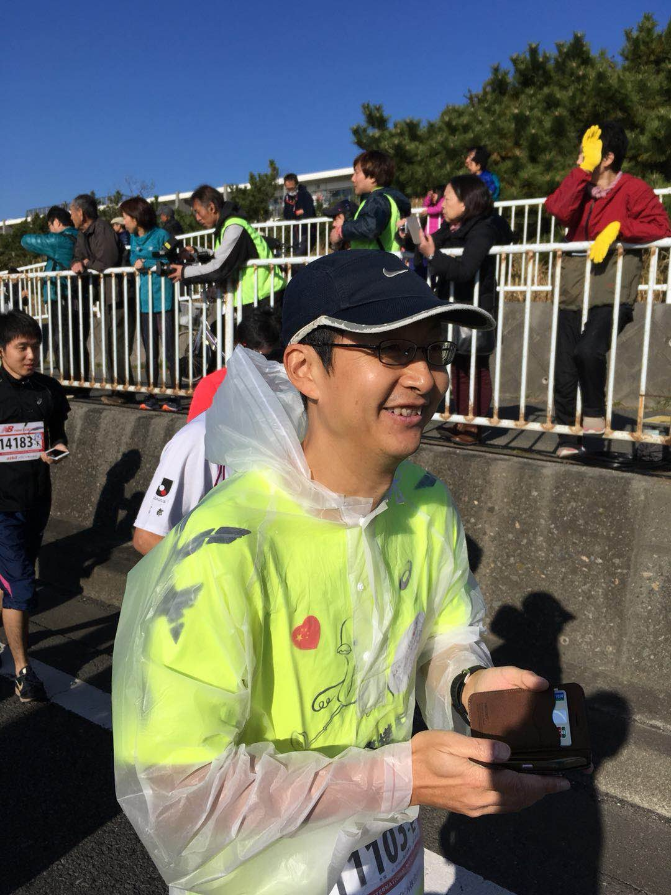

只要有心，人人均可破四。湘南首马体验
====

”在长跑中，如果说有什么必须战胜的对手，那就是过去的自己。”  
　　　　　　　　　　　　　　　　　　　　　　　　--村上春树　

12月3日的湘南国际马拉松已经过去了两天，大腿前侧的肌肉酸爽也基本恢复。趁着记忆还算清晰，整理一下自己首马的体验，希望这个流水账能给准备挑战首马的伙伴们提供一些参考。

## 0.第十二届湘南国际马拉松
[官网](http://www.shonan-kokusai.jp/12th/)

全马路线图

## 1.比赛当日

### 1.1 出发

五点二十起床。
早餐是鸡蛋面条，黄油面包一个，蛋糕两块，香蕉一根，橙汁一杯。能量补充完毕后，五点五十出门。  
慢跑往车站的路上，在十字路口巧遇小熊和横滨小姐姐，六点五分到达横滨东海道站台。顺利上车，车厢并没有想象中的拥挤，七点前到达二宫车站。  
和菜鸟大部队汇合但没有一起出发，独自去了车站旁的711便宜店买好运动饮料，上完厕所。徒步30分前往本次大会的起点终点所在地王子酒店，中途追上家麒教头和MT。家麒兄这次没有比赛专程远道而来督战，路上再次向我们强调了前半程控制配速的重要性。  
八点前到达会场，有3万多选手参加的市民马拉松，人群不断聚集的盛况，仿佛即将开始一个嘉年华。

合影

### 1.2 集合

风和日丽的天气让我犹豫是否要取消计划中的紧身长上衣。考虑片刻做出了当天的第一个正确决定，只穿草绿色菜鸟飞半袖衫战袍出征。  
换好衣服前往存包，套上了事先准备好的百元店雨衣保暖。集合地点旁的临时厕所前排起了长长的队伍，为了轻松上阵排在队尾开始漫长的等待。  
八点三十左右吃完了第一支能量棒，这是由彤老弟极力推荐，号称可以支撑100公里的好东西。上完厕所在八点五十左右和同在E区的彤老弟前往集合地点，我们的E区队伍已经不见踪影😓，只好跟着F区慢慢向起点前行。原本打算的热身活动已经没有时间，此为首马的第一处败笔。  
九点整听到远处一声枪响，应该是A区选手出发了。沿着队伍右侧边缘我们总算追到了E区的队尾，在上西湘Bypass高速入口处碰到了本应在C区的涛哥，看来他也是集合晚了😏。  
队伍里的人流默默徒步前行，时快时慢，大约在九点十五分总算走到了起点处。  

### 1.3 开跑-前10公里

跨过三条蓝色的记时毯，我的首马算是正式踏上征途。后来的记录显示，彤老弟和我分别以第12897，第12898的顺位起跑。人流缓慢，根本无法迈开双脚自由奔跑。彤老弟首马目标Sub4，看的出他有一点点焦虑，随即选择了最左侧的路肩开始上下跳跃前行。我也紧随其后，犹如两只草绿色的菜鸟在树枝缝隙间穿梭。跑出不远GARMIN开始第一次振动报时，抬手一看400米2:25。糟糕😓，前几天间隙跑训练后忘记了把手表调回1公里距离的记时，这是首马的第二个败笔。第一公里大概配速六分，还算不错。在浩荡的人流中，慢慢地活动开了肢体，感觉体温也稍稍上升没有了冷意，才在下了高速后约3.3公里的供水站前脱掉雨衣交给了旁边的志愿者。

按照计划沿道路左侧切入供水站，稍微降低配速从桌上快手取了一杯水后，慢慢转入道路右侧。第一次体验这种拿着敞口纸杯边跑边喝的玩法，喝了一口撒了一半在身上，很不习惯。扔掉水杯继续前行，却不见了彤老弟的身影。

通过了5公里的大竖排，心率呼吸正常。一个月前开始磨合的新跑鞋也给力，轻便节奏感强，自己的步伐也还算轻盈。总体来说，起跑顺利，开始有了成绩的想法。从7公里左右开始，塞车的问题基本减轻，可以迈开腿自由奔跑了，不过依然牢记家麒兄，勤奋大叔，章捉妖大神的赛前告诫，前半程温存体力，以期后半程超越的爽快。后来的记录显示，10公里通过成绩为56:15.

### 1.4 巡航20公里段

蓝色战袍背后的感谢，团结，3，4，右臂的国旗。跟上，互相鼓励，道声加油，继续前行。

14公里处的补给站，不二家的巧克力。

16公里处小姐姐。

过了17公里后第二只能量胶，

18公里江之岛第一折返点后，人群中寻找约好了过来加油的午餐会的朋友们，一直跑到半马处都没见踪影。

后来的记录显示，第二个10公里用时为56:14.

### 1.5 享受30公里段

摄影点。红心小国旗很给力。

路边开始有了停下来拉伸的选手。

富士山。

湘南马拉松的赛道是湘南海岸线134号国道的32公里加上西湘Bypass高速约10公里组成。聂耳

湘南海岸。

High Touch。

按manaxin大神推荐的训练表，

后来的记录显示，第三个10公里用时为56:32.

### 1.6 期盼第37公里

肌肉稍有有些紧绷，
32公里处，第三只能量胶。

35公里处在大磯港IC爬着缓坡又上了西湘Bypass高速。
小确幸

37公里，队长。

### 1.7 稍稍痛苦的最后5公里

从离开队长的地点到第二折返点的3公里，感觉路好长，一直是缓慢的上坡。虽然总体来看，远远没有到达想象中撞墙的程度，但应该算是这次首马旅途上自己的痛点了。心理盘算着保持配速估计就可以Sub4了，

折返完后还是上坡？难道我眼力出了问题,当时脑子里冒出一个念头：这是到了厦门怪坡了吗😊。

41公里处追上身披蓝色战袍的福建队林姐，虽然此前不曾谋面，在湘马群里早久闻大名，能并肩跑上一段感觉很荣幸。道声加油后，继续向前开始最后的冲刺。不远处就是高速的出口通向下坡  

婷婷和迪迪。聪哥完成了半马精英跑已经在终点处拿着相机等候。

4小时1分4秒，完成了人生首马。

到达终点处，膝盖完好，心率正常，体力仍存，斗志昂扬。
大腿前侧及小腿后侧肌肉稍紧绷，应该属于正常反应。对自己首马的身心状况，完赛过程点一个赞👍。
湘南首马，一次贵重的人生经验。

比赛成绩是你所付出努力的结果。
"真正身心受益、让人成长的是马拉松的训练过程，那是日复一日考验人的意志，锻炼人的自律精神。" --于珈

## 2.赛前准备

### 2.1 综合症（runner's Knee）

赛前一个月，11月3日上午的湘南海岸练习跑，第20公里处

整体院电疗，按摩，拉伸训练。

### 2.2 装备

跑鞋
轻巧，有节奏感

能量胶
100KM，15Km， 25Km， 35Km
盐丸
22， 27， 32， 37

### 2.3 赛前训练
基本按照manaxin大神提供的内容进行了赛前一个月的训练。
具体安排上比计划稍微减量，但很好的完成了21K，30K的配速跑，给自己在比赛时增加了信心。

回顾一下最近一个月的训练情景:
+ 11/3 湘南海岸练习跑LSD，配速630。第20公里处左膝外侧僵硬，开始到整体院电疗。
+ 11/5 华人马拉松接力赛踩点跑，5公里配速跑，455，左膝外侧恢复中。
+ 11/7 入手ASICS LyteRacer RS5，5公里

多摩川畔半马集训，冒病赶来的川北酒仙彤老弟，配速平稳成绩不断提高的东马选手瑞奇老弟，练就了九阴真经奔跑时就感觉不到他在呼吸的振老弟，体力可以支撑每周跑马的俊峰老弟，途中突然发力远超跑群到终点时却掉队找不到踪影的MT老弟。
+ 旅行中一起跑过了忠孝东路10Km和基隆河畔3Km的鲍桑，明年看好你的DEBUT。

## 3.经验教训

### 3.1 经验
准备充分，跑量基本到位，跑步中不断提高自己的向上心。

各位大神的经验谈及具体指导
甘，马，何，章，

配速 OK

### 3.2 教训
集合，厕所时间 NG
跑表设定 NG
吃能量胶是没有考虑到到补水站的距离。NG
最好快进补给站前吃，这样可以很快补充水分调整口内的不适感。
练习方面，还需理论指导下进行更加有效的训练 NG

### 3.3 今后的改善点

耐力网，何，马大神

咖啡能量胶

芍菊甘草片
url

## 4.目标展望

作为菜鸟二队第一个完成全马的队员，希望能激励其他战友，在快乐奔跑中取得更好的成绩。

跑力的提高，關鍵在訓練的品質，而不是量。
选择一段与跑友们共享。
https://www.runningquotient.com/article/single/64
......「每一個身體健康且喜歡跑步的跑者絕對都可以破四」，這是我毫不懷疑的信念，甚至我可以更大膽地說，每週只要練三次，週跑量不用50公里就可以順利破四。我很有信心，過去也有過很多案例證明這件事。關鍵是訓練的品質，只要跑步技術正確、訓練量有期期化安排，輔以跑錶的監控，破四一點都不難......

我明年的全马目标是Sub4。
心中已制定好了10K的三年计划和全马的五年计划。
期待在今后的赛道上继续和大家一起健康快乐地奔跑。
